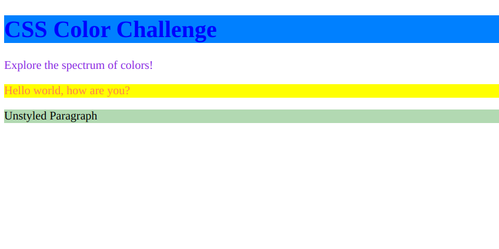

# Comprehensive CSS Color Practice

Get ready to dive into the vibrant world of CSS colors! This practice question will test your knowledge of different color concepts. Below is the given HTML structure:

```html
<!DOCTYPE html>
<html>
<head>
  <link rel="stylesheet" type="text/css" href="styles.css">
</head>
<body>
  <h1 id="main-title">CSS Color Challenge</h1>
  <p class="intro-paragraph">Explore the spectrum of colors!</p>
  <div id="color-box">Hello world, how are you?</div>
  <p>Unstyled Paragraph</p>
</body>
</html>
```



In the `styles.css` file linked above, complete the following tasks:

a) Using the **Foreground Color Property**:
Set the font color of the element with the ID "main-title" to a vivid shade of blue.

b) Using the **Background Color Property**:
Give the background of the `<div>` with the ID "color-box" a soft yellow color.

c) Using **RGB Color Value**:
Apply an RGB color value of `rgb(255, 99, 71)` to the text of the paragraph with class "intro-paragraph".

d) Using **RGBA Color Value**:
Create a semi-transparent backdrop for the "Unstyled Paragraph" using the RGBA color value `rgba(0, 128, 0, 0.3)`.

e) Using **HSL Color Value**:
Use an HSL color value of `hsl(210, 100%, 50%)` to paint the background of the "main-title".

f) Using **Hex Color Code**:
   Change the text color of the "intro-paragraph" to the hex color code `#8A2BE2`.

g) Using **Color Names**:
   Finally, give the text within the "color-box" the color name "coral".

Your `styles.css` should reflect the changes for each task. Be sure to use the appropriate CSS properties and values for each concept.

Get creative and enjoy experimenting with colors!
